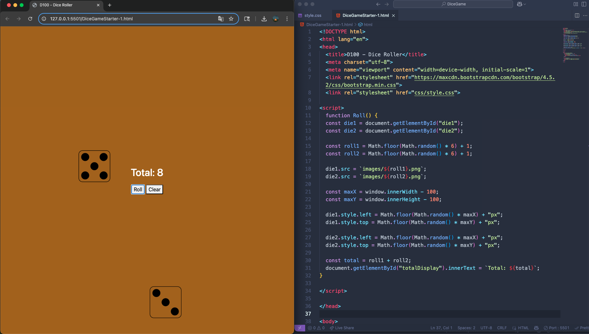

# 🎲 Dice Game

This project is a simple web-based dice roller built using HTML, CSS, and JavaScript. It was developed as part of a hands-on HTML course project to demonstrate core front-end development skills.



## 📋 Features

- 🎲 Simulates two six-sided dice
- 🧠 Uses `Math.random()` to generate rolls
- 📦 Dynamically updates dice images based on results
- 🧮 Displays the total of both dice
- 🖱️ "Roll" and "Clear" button functionality
- 🎨 Styled using Bootstrap and CSS with fixed layout

---

## 🧰 Tech Stack

- **HTML5** – Structure
- **CSS3** – Styling
- **JavaScript** – Logic and Interactivity
- **Bootstrap** – Button styling

---

## 🚀 How to Run Locally

1. Clone this repository:

   ```bash
   git clone https://github.com/DaltonG17/Dice-Game.git
   cd Dice-Game
